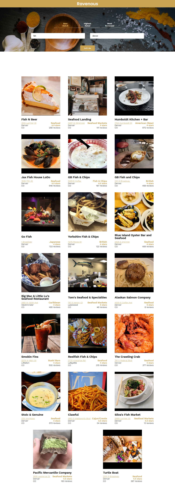

# Ravenous  

> A web application built on yelp's api.

## Table of contents  

- [General info](#general-info)
- [Screenshots](#screenshots)
- [Technologies](#technologies)
- [Setup](#setup)
- [Features](#features)
- [Status](#status)
- [Inspiration](#inspiration)
- [Contact](#contact)

## General info  

A web application built on yelp's api, that lets users search for restaurants based on ratings, best match, terms and location, view business pages on yelp and see locations on a map. 

## Screenshots  

## Technologies  

- Gh Pages - 3.1.0
- React - 16.13.1
- ReactDOM - 16.13.1
- React Scripts - 3.4.3

## Setup  

Visit [Ravenous](https://ravenousy.netlify.app/) in your browser.

## Features  

- Users can find businesses by using a search term and place.
- Users can filter businesses by searching for: best matched, most reviewed or highest rated.
- Users can click on business address to view the location on a map.
- Users can click on the business image to be redirected to the business' yelp page.

## Status  

Project is: _finished_

## Inspiration  

Project was inspired by a challenge on codecademy's web development path.

## Contact  

Created by [@funmilolajire](mailto:funmilolajire@gmail.com) - feel free to contact me!  

